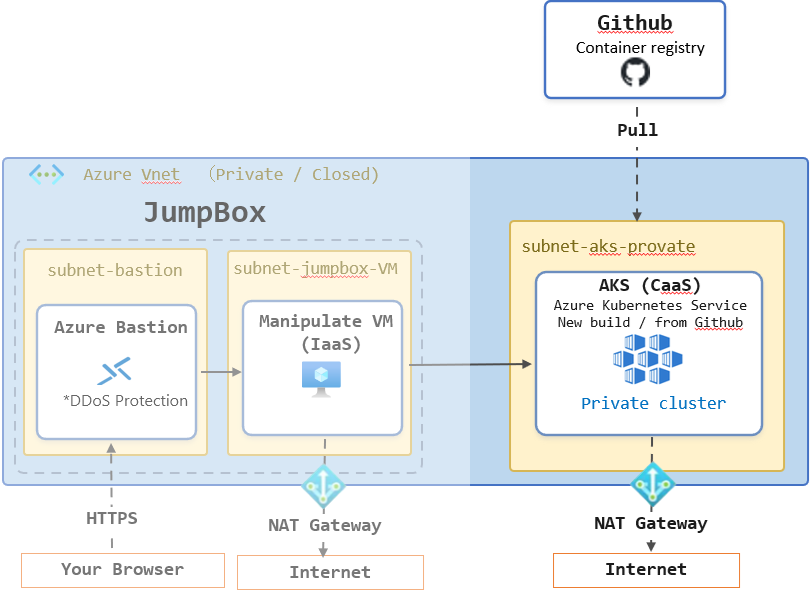

[\[**In English**\]](#build-an-azure-kubernetes-service-aks-cluster-isolated-within-an-azure-virtual-network)

# Azure の仮想ネットワークに閉域化された Azure Kubernetes Service (AKS) を構築する

Azure の仮想ネットワークのリソースにのみサービスを提供する Azure Kubernetes Service (AKS) クラスターを構築するための手順を説明します。

この手順で構築された AKS クラスターは、インターネットから直接アクセスできないように閉域化されます。これにより、セキュリティが強化され、内部ネットワーク内のリソースとの通信のみが可能になります。

ただし、AKS クラスターからのインターネットへのアクセスは可能とし、アプリケーションのコンテナイメージは GitHub Container Registry (GHCR) などから取得できるように構成します。

# 概要

オンプレミス環境から運用中のシステムを Microsoft Azure に移行する際、多くの場合、セキュリティの観点からインターネットに直接接続できない閉域化された環境での運用が求められます。Azure Kubernetes Service (AKS) Private クラスターは、マネージドな Kubernetes クラスターを提供するサービスであり、仮想ネットワーク内での閉域化された構成をサポートしています。

この手順ではすでに [Azure 上に仮想ネットワークと Jump Box (踏み台サーバー) が構築されている](https://github.com/osamum/HowtoMake-Az-JumpBox-Env)ことを前提とし、その既存の仮想ネットワーク内に AKS クラスターを構築する方法を説明します。AKS クラスターは、仮想ネットワーク内のリソースにのみアクセス可能であり、インターネットからの直接アクセスは制限されます。

 

# 前提条件

この手順を実施する前に、以下の前提条件を満たしている必要があります。

* Azure サブスクリプションが有効であること
* Azure ポータルにアクセスできること
* Azure の管理者権限か共同作成者の権限を持っていること
* 以下の手順で構築された仮想ネットワークと Jump Box が存在すること
  - [Azure の仮想ネットワークで閉域化された環境に安全にアクセスするための Jump Box 環境の構築](https://github.com/osamum/HowtoMake-Az-JumpBox-Env)

# この手順で構築される環境

既存の Azure 仮想ネットワーク内にインターネットからアクセス不能な Azure Kubernetes Service (AKS) プライベート クラスターを構築します。

また、AKS クラスターを構築するだけでなく、実際に GitHub Container Registry (GHCR) から [AKS Store Demo](https://github.com/Azure-Samples/aks-store-demo) のコンテナーイメージを取得してアプリケーションをデプロイして動作させるまでの手順を説明します。

# 手順

1. [既存の Azure 仮想ネットワークに AKS 用のサブネットを追加](jp-ex01.md)
2. [Azure Kubernetes Service (AKS) Private クラスターの構築](jp-ex02.md)
3. [Jump Box から AKS クラスターに接続し、アプリケーションをデプロイする](jp-ex03.md)

 

# Build an Azure Kubernetes Service (AKS) Cluster Isolated within an Azure Virtual Network

This guide explains how to build an Azure Kubernetes Service (AKS) cluster that provides services only to resources within an Azure virtual network.

The AKS cluster built in this guide is isolated so that it cannot be accessed directly from the internet. This enhances security by allowing communication only with resources on the internal network.

However, outbound internet access from the AKS cluster is permitted so that application container images can be pulled from registries such as GitHub Container Registry (GHCR).

# Overview

When migrating a production system from an on-premises environment to Microsoft Azure, security requirements often call for an isolated environment that cannot be accessed directly from the internet. Azure Kubernetes Service (AKS) Private Cluster is a managed Kubernetes service that supports private deployment within a virtual network.

This guide assumes that [an Azure virtual network and a Jump Box have already been created](https://github.com/osamum/HowtoMake-Az-JumpBox-Env). It explains how to build an AKS cluster in that existing virtual network. The AKS cluster is accessible only to resources within the virtual network, and direct access from the internet is restricted.

 

# Prerequisites

Before following this guide, ensure that the following prerequisites are met:

* You have an active Azure subscription.
* You can access the Azure portal.
* You have Azure Administrator or Contributor permissions.
* A virtual network and Jump Box created by following the guide below are available.
  - [Build a Jump Box Environment for Secure Access to an Isolated Azure Virtual Network](https://github.com/osamum/HowtoMake-Az-JumpBox-Env#building-a-jump-box-environment-for-secure-access-to-an-isolated-azure-virtual-network)

# Environment Built in This Guide

This guide builds a private Azure Kubernetes Service (AKS) cluster that cannot be accessed from the internet within an existing Azure virtual network.

In addition to building the AKS cluster, this guide explains how to pull the [AKS Store Demo](https://github.com/Azure-Samples/aks-store-demo) container images from GitHub Container Registry (GHCR), deploy the application, and verify that it is running.

# Steps

1. [Create a Subnet for AKS in an Existing Azure Virtual Network](en-ex01.md)
2. [Build a Private Azure Kubernetes Service (AKS) Cluster](en-ex02.md)
3. [Connect to the AKS Cluster from the Jump Box and Deploy an Application](en-ex03.md)

 

