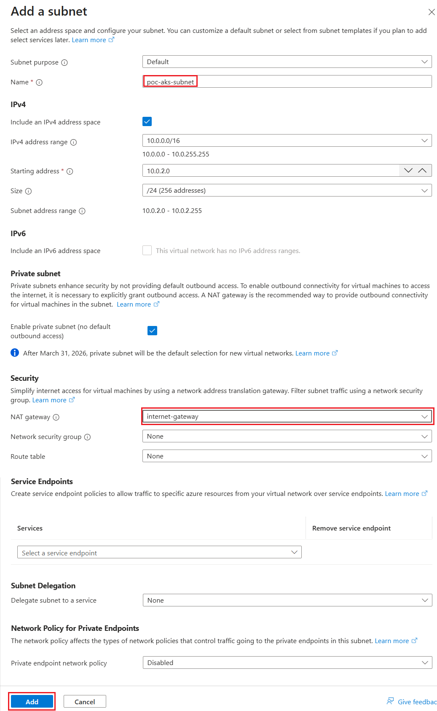

# 手順 1 : 既存の Azure 仮想ネットワークに AKS 用のサブネットを作成する

この手順では、既存の Azure 仮想ネットワークに Azure Kubernetes Service(AKS) クラスター用のサブネットを作成します。AKS クラスターは、専用のサブネット内で動作する必要があります。

なお、この手順では以下のドキュメントの手順で構築された仮想ネットワークと Jumpbox が存在することを前提としていますので、事前に以下の手順を実施しておいてください。

* [**Azure の仮想ネットワークで閉域化された環境に安全にアクセスするための Jump Box 環境の構築**](https://github.com/osamum/HowtoMake-Az-JumpBox-Env)

既存の Azure 仮想ネットワークに AKS 用のサブネットを作成する具体的な手順は以下のとおりです。

\[**手順**▶️\]

1. [Azure ポータル](https://portal.azure.com/)で、目的の仮想ネットワークの画面を開きます
   
2. 遷移した画面左側のメニューから \[設定\] - \[**サブネット**\] をクリックし、遷移した画面上部のメニューから \[**+ サブネット**\] をクリックします

   

3. 画面左に \[**サブネットの追加**\] ブレードが表示されるので各項目を以下のように設定します

    |項目|設定値|
    |:---|:---|
    |目的|Default|
    |名前 \*|`poc-aks-subnet`|
    |IPv4 アドレス空間を含める |**チェック**|
    |IPv4 アドレスの範囲|(既定で設定されているもの)|
    |開始アドレス \*|(既定で設定されているもの)|
    |サイズ|(既定で設定されているもの)|
    |IPv6 アドレス空間を含める|チェックしない|
    |プライベート サブネットを有効にする (既定の送信アクセスなし)|チェック|
    |NAT ゲートウェイ|`internet-gatway`を選択(※)|
    |ネットワークセキュリティグループ|なし|
    |ルートテーブル|なし|
    |サービス|指定しない|
    |サブネットをサービスに委任|なし|
    |プライベート エンドポイント ネットワーク ポリシー|無効|

    

    (※) [仮想ネットワーク環境の作成](https://github.com/osamum/HowtoMake-Az-JumpBox-Env/blob/main/jp-ex01.md) の手順で作成した NAT ゲートウェイを選択します。

    設定が完了したら画面下部の \[**追加**\] ボタンをクリックすると、サブネットが作成されます。

ここまでの手順で既存の仮想ネットワークへの AKS 用のサブネットの追加は完了です。

 

## 次へ

👉　[**手順 2 : Azure Kubernetes Service (AKS) Private クラスターの構築**](jp-ex02.md)

---

🏚️　[README に戻る](README.md)
