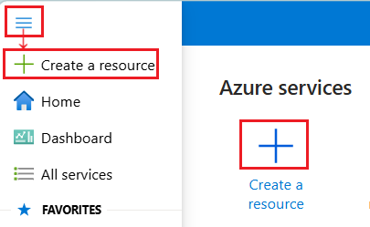
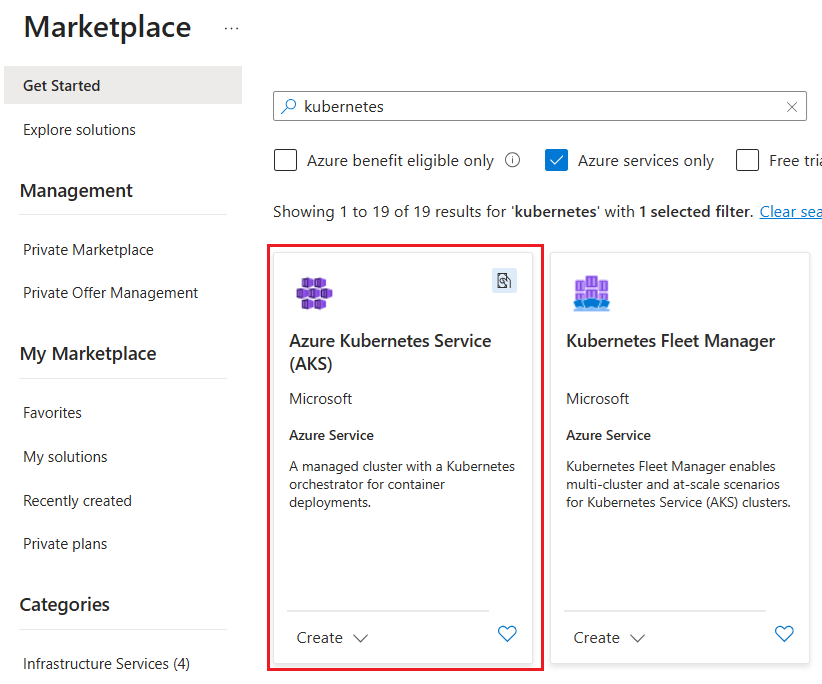
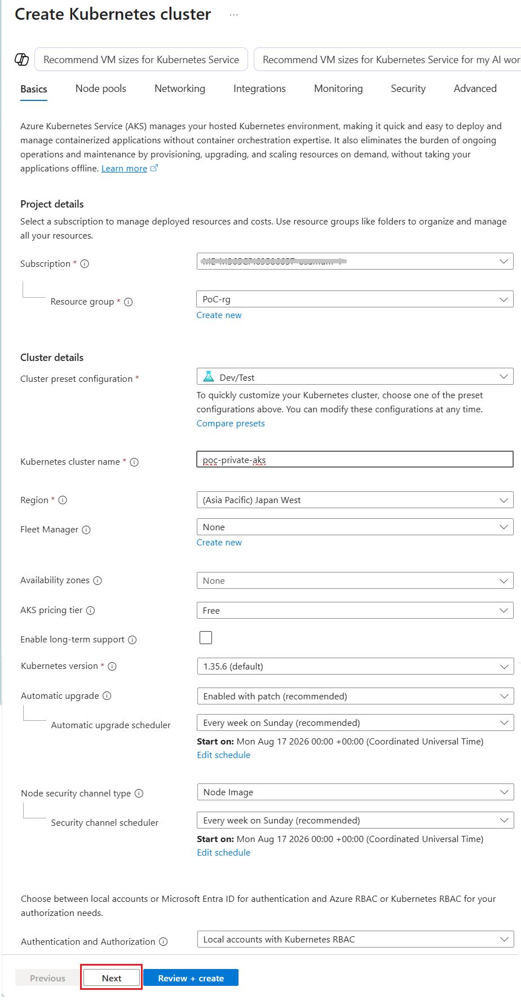
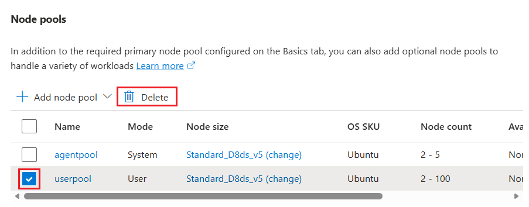
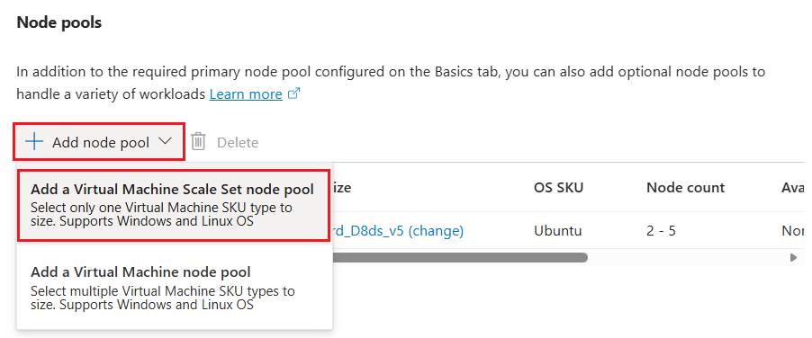
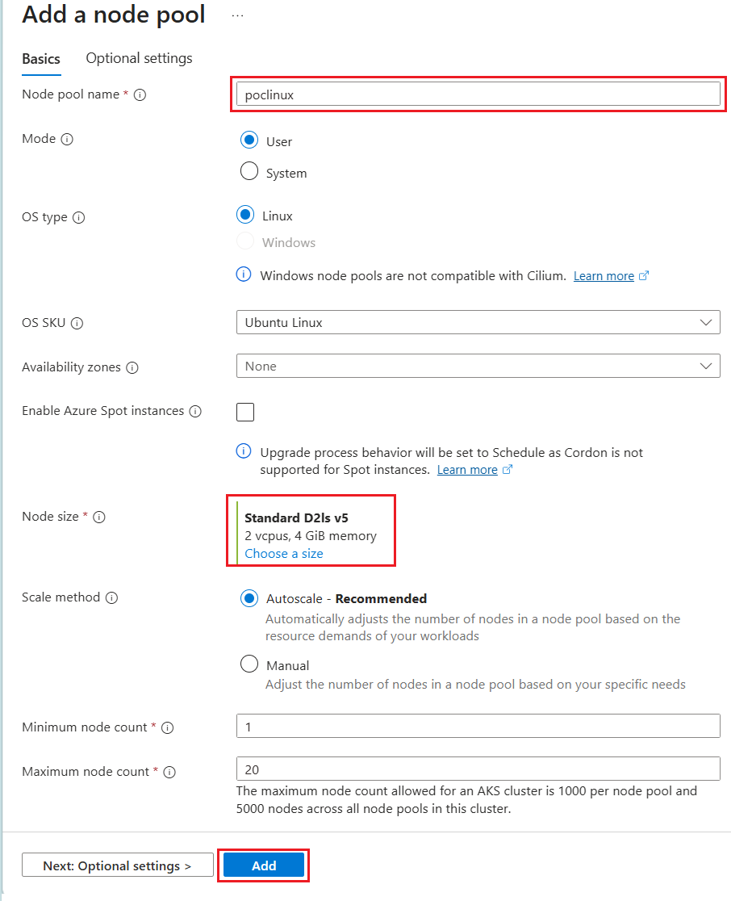
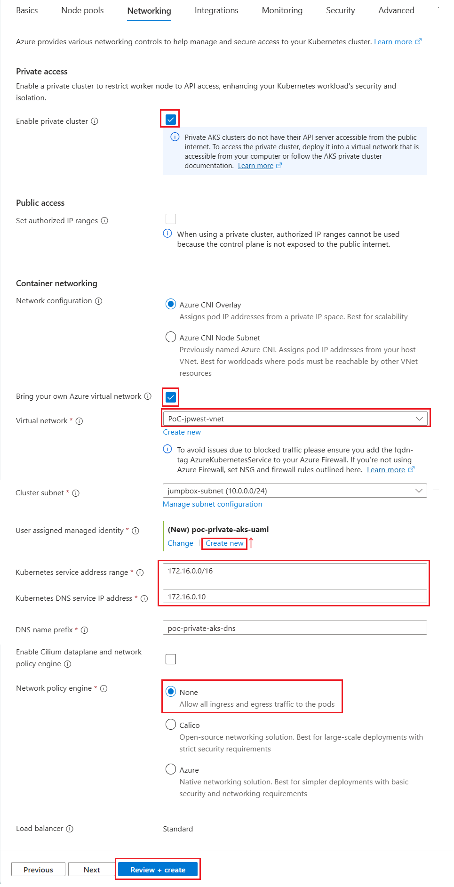

# 手順 2 : Azure Kubernetes Service (AKS) Private クラスターの構築

この手順では、既存の Azure 仮想ネットワークに Azure Kubernetes Service(AKS) Private クラスターを構築します。

なお現在、一般的な Azure Kubernetes Service(AKS) を構築する場合は [Azure Kubernetes Service (AKS) Automatic](https://learn.microsoft.com/ja-jp/azure/aks/intro-aks-automatic) が推奨されますが、今回の場合、これを使用すると手順が複雑になるので従来の方法を使用します。

また、この手順で構築される AKS クラスターは、デプロイされた仮想ネットワーク上にある Jumpbox 経由でないと操作が行えないので注意が必要です。

\[**手順**▶️\]

1. [Azure Portal](http://portal.azure.com) にログインし、ポータル画面上部の \[**+**\] リソースの作成アイコンをクリックします。アイコンが表示されていない場合は、画面左上のハンバーガーメニューをクリックし、\[**リソースの作成**\] をクリックします

    

2. \[**リソースの作成**\] 画面に遷移するので、検索ボックスに `kubernetes` と入力し、表示された検索結果の \[**Azure Kubernetes Service (AKS)**\] のタイルをクリックします

    

3. \[**Azure Kubernetes Service (AKS)**\] の画面に遷移するので、\[**作成**\] ボタンをクリックします

4. \[**Azure Kubernetes Service の作成**\] の画面の \[**基本**\] タブに遷移するので、各項目を以下のように設定します

    **プロジェクトの詳細**

    |項目|設定値|
    |:---|:---|
    |サブスクリプション \*|使用するサブスクリプション|
    |リソース グループ|\[*任意のリソースグループ*\]|

    **クラスターの詳細**

    |項目|設定値|
    |:---|:---|
    |クラスターのプリセット構成 \*|\[**Dev/Test**\] (※1)|
    |Kubernetes クラスター名 \*|`PoC-private-aks`|
    |リージョン \*|\[**(Asia Pacific) Japan West**\]|
    |フリートマネージャー|\[**なし**\]|
    |Availability zones|\[**なし**\]|
    |AKS 価格レベル \*|\[**無料**\](※2)|
    |長期的なサポートを有効にする|チェックしない|
    |Kubernetes バージョン|*既定のもの*|
    |自動アップグレード|\[**ノードイメージ**\]|
    |セキュリティ チャネル スケジューラ|\[**毎週日曜日(おすすめ)**\]|
    |認証と認可|\[**Kubernetes RBAC を使用したローカルアカウント**\]| 
    
    

    (※1)(※2) 今回は学習用のため、コストを抑えるために Dev/Test プリセット構成と無料価格レベルを使用します。実際の運用環境では、要件に応じて適切な構成を選択してください。

    設定が完了したら、画面下部の \[**次へ**\] ボタンをクリックします

5. **ノードプール**　画面に遷移するので、各項目を以下のように設定します

    **ノードプールの自動プロビジョニング**

    |項目|設定値|
    |:---|:---|
    |ノードプールの自動プロビジョニングの自動プロビジョニングを有効にする|**チェックしない**|

    **ノードプール**

    ノードプールを追加します。

    もし、既定で **userpool** が追加されている場合、それを使用しても構いませんが、学習目的でコストを下げるためノード数をより少なくしたいのであれば、既定で追加されている **userpool** にチェックをつけ \[**削除**\] ボタンをクリックして削除します。

    

    \[**+ ノードプールの追加**\] ボタンをクリックし、表示されたドロップダウンメニューで \[**仮想マシン スケールセットのノードプールを追加する**\] をクリックします。

    

    **ノードプールの追加** 画面に遷移するので、各項目を以下のように設定します

    |項目|設定値|
    |:---|:---|
    |ノード プール名 \*|`poclinux`|
    |モード |\[**ユーザー**\]|
    |OS タイプ |\[**Linux**\]|
    |OS SKU |\[**Ubuntu Linux**\]|
    |Availability zones|\[**なし**\]|
    |Enable Azure Spot instances|**チェックしない**|
    |ノードのサイズ \*|\[**Standard D2ls v5 2 vcpus, 4 GiB memorys**\]|
    |スケールの方法 |**オートスケール** - 推奨|
    |最小ノード数 \*|1|
    |最大ノード数 \*|20|

    

    設定が完了したら、画面下部の \[**追加**\] ボタンをクリックします。

    もとの \[**ノードプール**\] 画面に戻るので、画面下部の \[**次へ**\] ボタンをクリックします。

6. **ネットワーク** タブ画面に遷移するので、各項目を以下のように設定します

    |項目|設定値|
    |:---|:---|
    |プライベート クラスターを有効にする|**チェック**|
    |パブリック アクセス - 承認された IP 範囲の設定 |無効|
    |コンテナー ネットワーク - ネットワーク構成|\[**Azure CNI オーバーレイ**\]|
    |独自の Azure 仮想ネットワークを持ち込む|**チェック**|
    |仮想ネットワーク \*|\[`PoC-jpwest-vnet`\](※1)|
    |クラスターのサブネット \*|\[`poc-aks-subnet`\](※2)|
    |ユーザー割り当てマネージド ID \*| \[**新規作成**\] をクリックして作成|
    |Kubernetes サービスのアドレス範囲 \*|`172.16.0.0/16`(※3)|
    |Kubernetes DNS サービスの IP アドレス \*|`172.16.0.10`(※4)|
    |DNS 名のプレフィックス \*|*既定で設定される名前*|
    |Ciium データプレーンとネットワークポリシーエンジンを有効にする|チェックしない|
    |Network policy engine|\[**None**\]|

     

    (※1) 事前に作成した仮想ネットワーク `PoC-jpwest-vnet` を選択します。  

    (※2) 事前に作成した AKS クラスター用のサブネット `poc-aks-subnet` を選択します。

    (※3) Kubernetes サービスのアドレス範囲は、仮想ネットワークのサブネットのアドレス空間と重複しないように設定する必要があります。既定で設定される `10.10.0.0/16` は仮想ネットワークのサブネットのアドレス空間と重複するため、今回の例では `172.16.0.0/16` を指定しています。
    
    (※4) Kubernetes DNS サービスの IP アドレスは、Kubernetes サービスのアドレス範囲内で指定します。

    設定が完了したら、画面下部の \[**確認および作成**\] ボタンをクリックし、 \[**作成**\] ボタンが表示されたらクリックして AKS クラスターの作成を開始します。

ここまでの手順で Azure Kubernetes Service (AKS) Private クラスターの構築が完了しました。クラスターの作成には数分かかる場合がありますので、しばらく待ってから次の手順に進んでください。

 

## 次へ

👉　[手順 3: JumpBox から AKS クラスターに接続し、アプリケーションをデプロイする](jp-ex03.md)

---

🏚️　[README に戻る](README.md)
