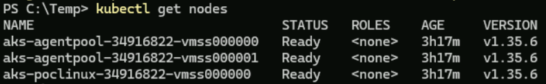
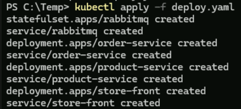
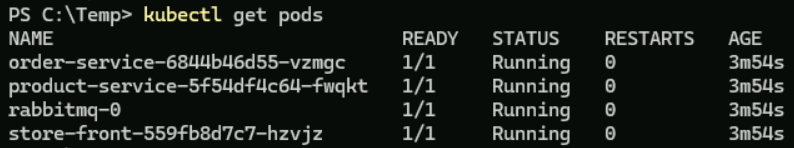
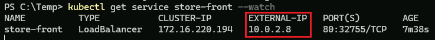
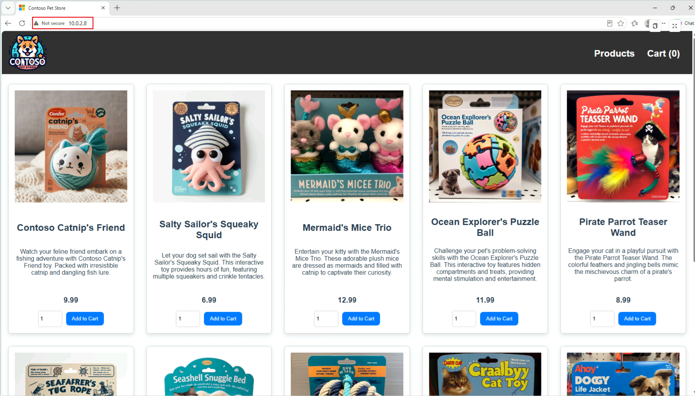

# 手順 3: Jump Box から AKS クラスターに接続し、アプリケーションをデプロイする

Azure Kubernetes Service (AKS) Private クラスターは API 接続も管理接続もプライベート IP アドレスでのみアクセス可能なため、インターネット経由で直接アクセスすることはできません。

よって、AKS Private クラスターを管理するには、同じ仮想ネットワーク内にある Jump Box のデスクトップ環境に接続し、ターミナル画面から Azure CLI を使用するか、同様に Jump Box 上の Web ブラウザーを使用して Azure ポータルにアクセスする必要があります。

この手順では Jump Box から AKS Private クラスターに接続するためのツールをインストールし、AKS Private クラスターに接続してアプリケーションをデプロイする手順を説明します。

## 準備 : Jump Box へのツールのインストール

AKS Private クラスターがデプロイされた仮想ネットワーク上にある Jump Box に接続し、ターミナル画面を起動して以下のコマンドを実行して、AKS Private クラスターに接続するための二つのツールをインストールします。

```powershell
# Azure CLI のインストール  
winget install --exact --id Microsoft.AzureCLI
```

```powershell
# kubectl のインストール
winget install --exact --id Kubernetes.kubectl
```

インストールが完了したらターミナル画面を再起動し、以下のコマンドを実行して、Azure CLI と kubectl が正しくインストールされていることを確認します。

```powershell
# Azure CLI のバージョン確認
az --version
```

```powershell
# kubectl のバージョン確認
kubectl version --client
```

これで、Jump Box から AKS Private クラスターに接続するための準備は完了です。

なお、この作業は初回のみ必要で、以降は Jump Box のターミナル画面から Azure CLI と kubectl を使用して AKS Private クラスターに接続することができます。

<br>

## AKS Private クラスターへの接続とアプリケーションのデプロイ

Jump Box のターミナル画面から AKS Private クラスターに接続して、Azure Kubernetes Service (AKS) の[クイックスタート用](https://learn.microsoft.com/azure/aks/learn/quick-kubernetes-deploy-portal)に用意されているアプリケーションをデプロイします。

具体的な手順は以下のとおりです。

\[**手順**▶️\]

1. Jump Box のターミナル画面から以下のコマンドを実行して、Azure にログインします。

    ```powershell
    az login
    ```

2. Azure にログインしたら、以下のコマンドを実行して、AKS Private クラスターの認証情報を取得し、kubectl コマンドで使用できるようにします。

    ```powershell
    az aks get-credentials --resource-group <リソースグループ名> --name <AKSクラスター名>
    ```
    この [az aks get-credentials](https://learn.microsoft.com/ja-jp/cli/azure/aks#az-aks-get-credentials) コマンドは、資格情報をダウンロードし、それを使用するように Kubernetes CLI を構成します

3. 認証情報の取得が完了したら、以下のコマンドを実行して、AKS Private クラスターに接続できることを確認します。

    ```powershell
    kubectl get nodes
    ```

    ノードの \[STATUS\] が **Ready** であることを確認してください。

    

4. アプリケーションをデプロイするための YAML ファイルを作成します。
   
   このリポジトリの assets/[deployApp-aks-private.yaml](./assets/deployApp-aks-private.yaml) の内容をコピーして (※)、Jump Box 上の任意のディレクトリに `deploy.yaml` という名前で保存します。

   その際に yaml 内の以下の点を確認してください:

   * 各 `Deployment` の `image` の値が、Github Container Registry(GHCR) のものになっていること
   * コメント `# Use internal load-balancer.` を検索し、ロードバランサーが以下のようにインターナルのロードバランサーが使用されるように設定されていること

    ```yaml
    # Use internal load-balancer.
    annotations:
      service.beta.kubernetes.io/azure-load-balancer-internal: "true"
    ```
    (※) 必ずこのリポジトリの yaml ファイルを使用してください。Azure のクイックスタート用の yaml ファイルは、ロードバランサーがパブリックのロードバランサーが使用されるように設定されているため、AKS Private クラスターでは使用できません。また、order-service の設定部分のバージョンの指定に問題があるためそもそも動作しません。

5. 以下のコマンドを実行して、アプリケーションをデプロイします。

    ```powershell
    kubectl apply -f deploy.yaml
    ```
    yaml で指定された Deployment と Service が表示されます。

    

6. [kubectl get pods](https://kubernetes.io/docs/reference/generated/kubectl/kubectl-commands#get) コマンドを使用して、デプロイされたポッドの状態を確認します。 

    ```powershell
    kubectl get pods
    ```
    すべてのポッドの \[STATUS\] が **Running** の状態になるまで待ちます。

    

7. `store-front` アプリケーションのパブリックIPアドレスを確認します。--watch 引数を指定した [kubectl get service](https://kubernetes.io/docs/reference/generated/kubectl/kubectl-commands#get) コマンドを使用して、進行状況を確認します

    ```powershell
    kubectl get service store-front --watch
    ```

    `EXTERNAL-IP` の値がローカル IP アドレスであることを確認します。

    

8. Jump Box 上の Web ブラウザーを使用して、`EXTERNAL-IP` に表示されたアプリケーションの IP アドレスにアクセスします。

    例: `http://<EXTERNAL-IP>`

    

ここまでの手順で、Jump Box から AKS Private クラスターに接続し、アプリケーションをデプロイすることができました。

この手順では、Jump Box のローカル環境のターミナル画面から Azure CLI と kubectl を使用して AKS を操作しましたが、Azure ポータルを使用する場合も同様で、必ず Jump Box 上の Web ブラウザーを使用して Azure ポータルにアクセスする必要があります。

<br>

👈 [手順 2 : Azure Kubernetes Service (AKS) Private クラスターの構築](jp-ex02.md)

---

🏚️　[README に戻る](README.md)